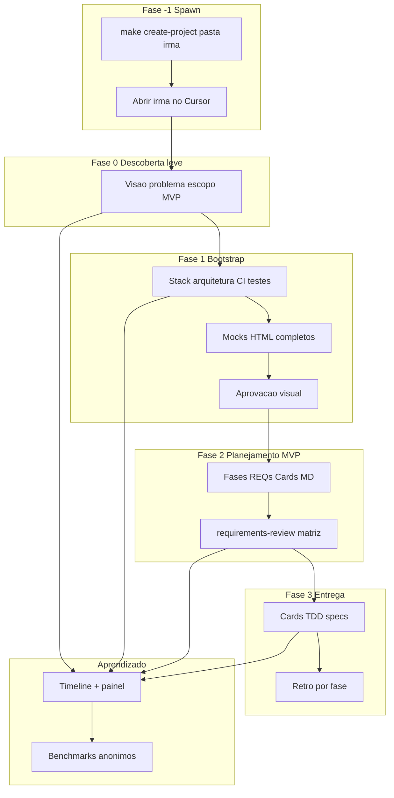

# Ciclo de vida do projeto (método Modelo)

Mapa único do funil: **ideia → contrato técnico e visual → planejamento executável do MVP → entrega**, com métricas que refinam a cada interação.

---

## Visão geral



| Fase | Gate (`project.config.yaml`) | Skill principal |
|------|------------------------------|-----------------|
| −1 Spawn | `template.is_upstream: false` + `.modelo-product-workspace` | `make create-project` (no upstream) |
| 0 Descoberta leve | `discovery.status: complete` | `project-discovery` |
| 1 Bootstrap + mocks | `bootstrap.status: complete` + `design.status: approved` (se front) | `project-bootstrap` |
| 2 Planejamento MVP | `mvp_planning.status: complete` | `project-mvp-planning` |
| 3 Entrega | Card `in_progress` + spec `approved` | `card-tracking`, `feature-delivery` |

---

## Fase −1 — Spawn (pasta irmã)

**Objetivo:** isolar métricas, hub, mocks e REQs — **um produto por pasta**, irmã do Modelo upstream.

**Comando (no Modelo):** `make create-project NAME="<produto>" GIT_INIT=1`

**Depois:** abrir a pasta irmã no Cursor; **não** desenvolver produto dentro de `Modelo/`.

**Config:** `template.is_upstream: false`, `project.name`, marcador `.modelo-product-workspace`.

Guia completo: [operations/spawn-project.md](operations/spawn-project.md)

---

## Fase 0 — Descoberta leve

**Objetivo:** refinar a ideia — visão, problema, escopo narrativo do MVP, restrições, hints de stack.

**Não exige:** fases, REQs nem cards fechados (pode haver rascunho opcional).

**Artefatos:** [discovery/product-discovery.md](discovery/product-discovery.md), [discovery/bootstrap-hints.md](discovery/bootstrap-hints.md), [discovery/vision-review.md](discovery/vision-review.md).

**Confirmação humana:** checklist em `vision-review.md` → `discovery.review_confirmed_at`.

Guia: [DISCOVERY.md](DISCOVERY.md)

---

## Fase 1 — Bootstrap, arquitetura e mocks

**Objetivo:** definir **como o projeto evolui tecnicamente** e o **contrato visual** clicável.

**Artefatos:** `project.config.yaml`, [02-architecture.md](02-architecture.md), `design-references/`, OpenAPI, CI.

**Métricas:** marco `architecture_baseline` · painel [process-metrics](meta/process-metrics/index.html) · [quality-health](meta/quality-health/index.html) após testes.

**Gates:** `bootstrap.status: complete`; se `has_frontend: true` → `design.status: approved`.

Guia: [BOOTSTRAP.md](BOOTSTRAP.md)

---

## Fase 2 — Planejamento executável do MVP

**Objetivo:** planejar **todo o projeto** para atingir a entrega do MVP — fases, REQs, cards, rastreabilidade.

**Pré-requisitos:** bootstrap completo; design aprovado (se houver front).

**Artefatos:** [planning/mvp-phases.md](planning/mvp-phases.md), [planning/cards-backlog.md](planning/cards-backlog.md), [tracking/cards/](tracking/cards/), [backlog/mvp-backlog.md](backlog/mvp-backlog.md), [discovery/requirements-review.md](discovery/requirements-review.md), [traceability-matrix.md](traceability-matrix.md).

**Gate:** todo REQ em ≥1 card; humano confirma review → `mvp_planning.status: complete`.

**Métricas:** marco `mvp_planning_end`; primeira baseline de **projeção estatística** no painel (não é data de negócio).

Skill: `project-mvp-planning`

---

## Fase 3 — Entrega e melhoria contínua

1. Abrir card → spec approved → TDD (`feature-delivery`)
2. Fechar card; retro ao concluir fase (`phase-retrospective`)
3. **Métricas vivas:** rodada por turno; rebuild painel; `opened_at`/`done_at` nos cards

Painel: **Project Hub** Overview — `make hub-serve` → http://localhost:8090/project-hub/

---

## Base de conhecimento entre projetos

Após o projeto (ou por fase):

1. Export: `./scripts/export-process-benchmark.sh`
2. Agregar lições: [meta/improving-the-template.md](meta/improving-the-template.md) + retros

Ver [meta/process-benchmarks/README.md](meta/process-benchmarks/README.md)

---

## Migração (projetos já iniciados)

Se `discovery.status: complete` **e** backlog/cards já existem antes desta divisão de fases:

```yaml
mvp_planning:
  status: complete
  review_confirmed_at: <data da requirements-review existente>
```

---

## Links rápidos

| Documento | Uso |
|-----------|-----|
| [00-getting-started.md](00-getting-started.md) | Passo a passo |
| [operations/spawn-project.md](operations/spawn-project.md) | Fase −1 spawn + config |
| [DISCOVERY.md](DISCOVERY.md) | Fase 0 |
| [BOOTSTRAP.md](BOOTSTRAP.md) | Fase 1 |
| [meta/process-metrics.md](meta/process-metrics.md) | Tempos e painel |
| [00-project-governance.md](00-project-governance.md) | Regras SDD/TDD |
