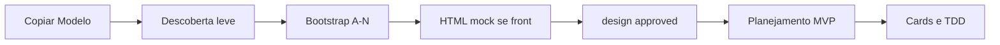

# Bootstrap — o que é e como usar

O **bootstrap** é a **configuração inicial do projeto**: uma conversa guiada (com a IA) que transforma o template Modelo genérico no **seu** produto — com stack, testes, CI, protótipo HTML, logs, segurança e rastreio definidos.

Não é instalação de dependências nem `npm install`. É **preencher o contrato do projeto** antes de escrever código de produção.

**Antes do bootstrap:** [Descoberta leve](DISCOVERY.md) (fase 0) — visão e escopo do MVP, sem planejamento executável de cards/REQs.

**Depois do bootstrap e mocks aprovados:** [Planejamento MVP](00-project-lifecycle.md#fase-2--planejamento-executável-do-mvp) (skill **project-mvp-planning**).

---

## Por que existe

O Modelo é só **governança** (docs, regras, templates). Cada produto real precisa de respostas diferentes:

- Tem front? Back? Banco?
- React ou Vue? Node ou Python?
- CI no GitHub ou GitLab?
- Quais telas do MVP no HTML mock?

O bootstrap grava essas respostas em **`project.config.yaml`** e gera/atualiza os arquivos relacionados.

---

## O que acontece no bootstrap



| Você fornece | A IA gera/atualiza |
|--------------|-------------------|
| Nome, MVP, responsáveis | `docs/01-product-vision.md` |
| Stack (linguagens, DB) | `docs/02-architecture.md`, rules de stack |
| Ferramentas de teste | `docs/testing/test-strategy.md` |
| Plataforma CI | `.github/workflows/` ou `.gitlab-ci.yml` |
| Telas e fluxos | `design-references/screens/*.html` |
| Ambientes, LGPD, i18n | `.env.example`, docs de ops/security |

---

## Blocos do questionário (A–N)

A IA pergunta **em lotes** (5–8 por vez), nesta ordem:

| Bloco | Tema | Exemplo do que define |
|-------|------|------------------------|
| **A** | Identidade | Nome do produto, idioma da doc |
| **B** | Stack | Node + React, monorepo?, auth |
| **C** | Infra | Docker, PostgreSQL, migrations |
| **D** | Testes | Jest, Vitest, Playwright, cobertura 90% |
| **E** | CI | GitHub Actions ou GitLab |
| **F** | Contratos | OpenAPI contract-first, SLA |
| **G** | Logs | Pino, JSON, correlation id |
| **H** | Design | Telas MVP → HTML mockado (se front) |
| **I** | Segurança | Secrets, SAST |
| **J** | Rastreio e cards | REQs, CARD MD, provider (Jira/GitHub/…), branches |
| **K** | i18n | Multilíngue ou pt-BR único |
| **L** | E2E | Fluxos críticos (login, pagamento…) |
| **M** | Ambientes | dev/staging/prod, `.env.example` |
| **N** | LGPD | Dados pessoais, retenção |

Detalhe por bloco: [.cursor/skills/project-bootstrap/questionnaire.md](../.cursor/skills/project-bootstrap/questionnaire.md)

---

## Como utilizar (passo a passo)

### 1. Crie a pasta irmã (a partir do Modelo upstream)

```bash
cd Modelo
make create-project NAME="Meu Produto" GIT_INIT=1
cd ../meu-produto   # ou o DIR= que você passou
```

Abra a pasta irmã no Cursor. Não faça bootstrap dentro de `Modelo/` (template upstream).

### 2. Abra no Cursor

As rules em `.cursor/rules/` carregam automaticamente.  
`project.config.yaml` começa com `discovery.status: pending` e `bootstrap.status: incomplete`.

### 3. Descoberta (fase 0)

Guia: [DISCOVERY.md](DISCOVERY.md). Prompt **Descoberta do projeto** em [prompts/primeira-conversa.md](prompts/primeira-conversa.md).

Confirme [vision-review.md](discovery/vision-review.md) antes de `discovery.status: complete`.

### 4. Cole o prompt de bootstrap

Em [docs/prompts/primeira-conversa.md](prompts/primeira-conversa.md) (após `discovery.status: complete`):

```
Pré-requisito: discovery.status: complete (vision-review) OU discovery.skipped: true.

Execute o bootstrap usando a skill project-bootstrap, bloco por bloco (A–N).
Leia docs/discovery/ — confirme sugestões nos blocos A e B.
Não implemente código de produto até bootstrap.status: complete e, se front, design.status: approved.
```

Prompt completo: seção **Projeto novo (bootstrap)** em [primeira-conversa.md](prompts/primeira-conversa.md).

### 5. Responda as perguntas do bootstrap

Tenha em mãos (não precisa tudo de uma vez):

- O que o produto faz (MVP)
- Stack desejada (ou “ainda não sei” — a IA ajuda a decidir)
- Descrição das telas (texto; não precisa Figma)
- Se haverá API, banco, login

### 6. Revise o protótipo HTML (se front)

```bash
cd design-references && python3 -m http.server 8080
# Abrir screens/*.html no navegador
```

Aprove em `design-references/APPROVAL.md` e diga na conversa: *"Aprovo o padrão visual"*.

### 7. Planejamento MVP (após mocks aprovados)

Skill **project-mvp-planning** — fases, REQs, cards, `requirements-review.md`. Ver [00-project-lifecycle.md](00-project-lifecycle.md).

### 8. Confirme conclusão do bootstrap

No `project.config.yaml`:

```yaml
bootstrap:
  status: complete
  completed_at: "2026-06-02T12:00:00Z"
  sections:
    A_identidade: complete
    # ... demais blocos complete
```

Referência de config preenchida: [project.config.example.yaml](../project.config.example.yaml)

---

## Retomar bootstrap interrompido

```
Leia project.config.yaml e liste quais seções ainda estão pending.
Continue o bootstrap de onde parou (skill project-bootstrap).
```

---

## Gates — o que a IA bloqueia até terminar

| Condição | Permitido | Bloqueado |
|----------|-----------|-----------|
| `discovery.status != complete` (e não skipped) | `docs/discovery/`, visão | Bootstrap, planejamento MVP, código |
| `bootstrap.status: incomplete` | Config, docs, HTML mock | Código do app (back/front) |
| `design.status != approved` (com front) | Evoluir HTML mock | Framework UI (React, etc.) |
| `mvp_planning.status != complete` | `docs/planning/`, cards, review | feature-delivery, card in_progress |
| Spec não aprovada | Editar spec | Implementar feature |

Regra Cursor: `.cursor/rules/000-onboarding-gate.mdc`

---

## Descoberta ≠ bootstrap ≠ aprovação visual ≠ primeira feature

| Fase | Objetivo |
|------|----------|
| **Descoberta** | Ideia, escala, MVP, backlog REQ, revisão IA |
| **Bootstrap** | Configurar o projeto (stack, CI, mock MVP) |
| **Aprovação HTML** | Travar padrão visual (`design.status: approved`) |
| **Feature-delivery** | Spec aprovada + TDD no código real |

Ordem: **descoberta** → **bootstrap** → **aprovar HTML** (se front) → **spec + TDD**.

---

## Onde está documentado hoje

| Documento | Conteúdo |
|-----------|----------|
| [DISCOVERY.md](DISCOVERY.md) | Fase 0 — descoberta e revisão IA |
| **Este arquivo** | Guia completo do bootstrap |
| [00-getting-started.md](00-getting-started.md) | Fases 0–3 no fluxo geral |
| [prompts/primeira-conversa.md](prompts/primeira-conversa.md) | Prompts copiáveis |
| [.cursor/skills/project-discovery/](../.cursor/skills/project-discovery/) | Skill descoberta |
| [.cursor/skills/project-bootstrap/](../.cursor/skills/project-bootstrap/) | Skill + questionário A–N |
| [ESTRUTURA-DO-TEMPLATE.md](ESTRUTURA-DO-TEMPLATE.md) | O que o bootstrap gera |
| [AGENTS.md](../AGENTS.md) | Instruções para a IA |

---

## FAQ

**Preciso responder tudo numa sessão?**  
Não. A IA salva progresso em `project.config.yaml` (`sections: pending/complete`).

**Posso pular o bootstrap?**  
Só com ADR + preenchimento manual cuidadoso do config. Não recomendado.

**Bootstrap gera código backend/frontend?**  
Não. Gera config, docs, CI template, HTML mock. Código vem depois com `feature-delivery` + TDD.

**Já tem telas demo no Modelo?**  
Sim (`login`, `dashboard`, `item-form`) como **exemplo**. No bootstrap do seu projeto, substitua ou estenda conforme o MVP.
