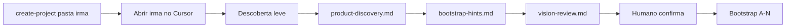

# Descoberta leve (fase 0)

Conversa sobre a **ideia do produto** antes do bootstrap. Objetivo: **visão, escopo narrativo do MVP e hints de stack** — não o planejamento executável (fases/cards/REQs).

> Planejamento completo do MVP: após mocks e arquitetura — ver [00-project-lifecycle.md](00-project-lifecycle.md) e skill **project-mvp-planning**.

## Pré-requisito — Fase −1 Spawn

Discovery roda **na pasta irmã do produto**, não no Modelo upstream.

1. No Modelo: `make create-project NAME="<produto>" GIT_INIT=1`
2. Abrir a pasta irmã no Cursor (`.modelo-product-workspace` presente)
3. Config: [operations/spawn-project.md](operations/spawn-project.md)

## Quando usar

- Produto spawnado (`discovery.status: pending`, `template.is_upstream: false`)
- Refinar ideia sem fixar CI nem cards ainda

## Fluxo

1. Prompt **Descoberta do projeto** ([prompts/primeira-conversa.md](prompts/primeira-conversa.md))
2. Skill **project-discovery**
3. Humano confirma [discovery/vision-review.md](discovery/vision-review.md)
4. `discovery.status: complete` → bootstrap

## O que NÃO é gate desta fase

- Todo REQ em card (isso é fase 2 — `mvp_planning`)
- `requirements-review.md` completo
- `validate-planning.sh` obrigatório aqui

## Artefatos (fase 0)

| Arquivo | Função |
|---------|--------|
| [discovery/product-discovery.md](discovery/product-discovery.md) | Visão, problema, escopo MVP |
| [discovery/bootstrap-hints.md](discovery/bootstrap-hints.md) | Stack sugerida |
| [discovery/vision-review.md](discovery/vision-review.md) | Checklist humano fase 0 |
| Rascunho opcional | `01-product-vision.md` (bootstrap A preenche) |

## Métricas

- Primeiro turno: `process_metrics.project_started_at` se null
- Marco `discovery` no [process-timeline.yaml](meta/process-timeline.yaml)

## Próximo passo

[BOOTSTRAP.md](BOOTSTRAP.md) → depois [planejamento MVP](00-project-lifecycle.md#fase-2--planejamento-executável-do-mvp) com **project-mvp-planning**.
