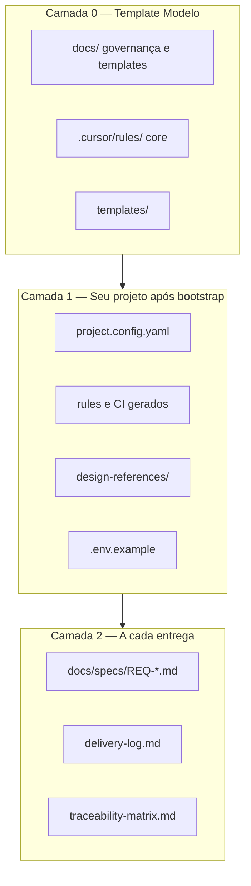

# Estrutura do template — pastas, arquivos e configurações

Este documento explica **o que é cada parte** do repositório Modelo: para que serve, quando muda e quem preenche (você, bootstrap ou IA).

---

## Visão em três camadas



| Camada | Quando muda | Exemplos |
|--------|-------------|----------|
| **0** | Raramente; evolui o repo Modelo | governance, rules core, templates |
| **1** | Uma vez no bootstrap (+ revisões pontuais) | `project.config.yaml`, stack, CI, HTML mock |
| **2** | A cada feature/entrega | specs, delivery-log, matrix |

---

## Árvore completa do repositório

```txt
Modelo/
├── INICIO.md                      # Entrada humana — leia primeiro
├── README.md                      # Visão geral do template
├── AGENTS.md                      # Entrada para IA na IDE
├── project.config.yaml            # Config viva do projeto (bootstrap preenche)
├── project.config.example.yaml    # Exemplo após bootstrap completo
├── .env.example                   # Variáveis de ambiente (bootstrap bloco M)
│
├── .cursor/
│   ├── rules/                     # Project Rules Cursor (.mdc)
│   │   ├── 000-onboarding-gate.mdc    # Gate descoberta + bootstrap + design
│   │   ├── 001-governance-summary.mdc # Resumo SDD/TDD (alwaysApply)
│   │   ├── 010-sdd-tdd.mdc
│   │   ├── 012-spec-gate.mdc
│   │   ├── 020-openapi-contract.mdc
│   │   ├── 040-testing.mdc
│   │   ├── 050-security.mdc
│   │   ├── 060-logging.mdc          # Refinada no bootstrap G
│   │   ├── 070-ui-reference.mdc
│   │   └── 071-ui-change-propagation.mdc
│   └── skills/
│       ├── project-discovery/     # Fase 0 — fases, cards, REQs
│       ├── project-bootstrap/     # Questionário A–N, após descoberta
│       ├── card-tracking/         # Abrir/atualizar/fechar CARD
│       └── feature-delivery/      # TDD a partir de card in_progress
│
├── docs/
│   ├── DISCOVERY.md               # Fase 0 — descoberta do produto
│   ├── discovery/                 # product-discovery, bootstrap-hints, requirements-review
│   ├── planning/                  # mvp-phases.md, cards-backlog.md
│   ├── backlog/                   # mvp-backlog.md (REQs)
│   ├── tracking/cards/            # CARD-XXX.md (canônico, obrigatório)
│   ├── 00-getting-started.md      # Passo a passo de uso
│   ├── 00-project-governance.md   # Regras completas SDD/TDD/DoR/DoD
│   ├── ESTRUTURA-DO-TEMPLATE.md   # Este arquivo
│   ├── 01-product-vision.md       # Gerado bootstrap A
│   ├── 02-architecture.md         # Gerado bootstrap B/C
│   ├── design-system.md           # Tokens/componentes (bootstrap H)
│   ├── i18n.md                    # Idioma único ou multilíngue (bootstrap K)
│   ├── delivery-log.md            # Registro de entregas
│   ├── traceability-matrix.md     # REQ → spec → testes → PR
│   ├── tech-debt.md               # Pendências aceitas
│   ├── prompts/                   # Textos para colar no chat
│   ├── specs/                     # Specs (REQ-*.md), req-slicing, req-validation-checklist
│   ├── adr/                       # Decisões técnicas
│   ├── api/                       # OpenAPI, erros, versionamento
│   ├── testing/                   # Estratégia, TDD, sync mock/API
│   ├── security/                  # Checklists, LGPD, threat model
│   ├── database/                  # Política de migrations
│   ├── observability/             # Padrão de logs
│   ├── operations/                # Ambientes, hotfix
│   ├── examples/                  # Walkthrough ponta a ponta
│   ├── templates/                 # code-review (cópia auxiliar)
│   └── meta/                      # Retroalimentar o repo Modelo
│       ├── improving-the-template.md
│       ├── process-timeline.yaml    # Métricas de tempo (fonte da verdade)
│       ├── process-timeline.schema.yaml
│       ├── process-metrics.md
│       ├── process-metrics-log.md
│       ├── project-hub.md         # Monitoria unificada — o que é / o que faz
│       ├── project-hub/           # Project Hub (Overview + Processo + Qualidade + …)
│       ├── process-metrics/       # Módulo Processo (embed no hub; legado isolado deprecated)
│       ├── quality-health/        # Módulo Qualidade (embed no hub; legado isolado deprecated)
│       ├── process-benchmarks/    # Export anonimizado entre projetos
│       └── retrospectives/        # Retro por FASE (processo; soft gate)
│           ├── README.md
│           ├── index.md
│           ├── _template-fase-retro.md
│           └── FASE-X-retro.md    # Uma por fase entregue
│
├── design-references/             # Protótipo HTML mockado (contrato visual)
│   ├── README.md
│   ├── APPROVAL.md                # Checklist + a11y + aprovação humana
│   ├── _template-screen.html
│   ├── shared/
│   │   ├── design-tokens.css      # Cores, fontes, espaçamentos
│   │   ├── components.css         # Botões, inputs, cards (padrão locked)
│   │   ├── mock-data.js
│   │   ├── mock-api.js
│   │   └── mock-router.js
│   └── screens/                   # Uma ou mais HTML por tela/fluxo (produto)
│
├── templates/                     # Moldes copiados/gerados no bootstrap
│   ├── project-config.schema.yaml # Referência do config
│   ├── ci/                        # GitHub Actions / GitLab CI (.tpl)
│   ├── hooks/                     # Pre-commit (README + setup)
│   ├── env/.env.example.tpl
│   ├── docker/                    # Snippets Docker (se bloco C)
│   └── cursor-rules/              # backend-node, frontend-react (.tpl)
│
├── scripts/
│   ├── validate-template.sh       # Smoke: arquivos essenciais existem
│   ├── validate-html-prototype.sh # Smoke: protótipo HTML íntegro
│   ├── validate-config.sh         # Smoke: project.config.yaml completo
│   └── validate-traceability.sh   # Backlog ↔ matrix (avisos)
│
└── .github/
    ├── pull_request_template.md   # Checklist de PR
    ├── CODE_REVIEW.md             # Checklist de review
    └── workflows/
        └── validate-modelo.yml    # CI do próprio template Modelo
```

---

## Raiz — arquivos principais

| Arquivo | Propósito | Quem edita |
|---------|-----------|------------|
| `INICIO.md` | Porta de entrada humana; links rápidos | Template Modelo |
| `README.md` | Descrição do template para GitHub/equipe | Template Modelo |
| `AGENTS.md` | Instruções para agentes de IA | Template + ajustes locais |
| `project.config.yaml` | **Fonte de verdade** de gates e parâmetros | Bootstrap + IA |
| `project.config.example.yaml` | Referência de config preenchida | Documentação |
| `.env.example` | Variáveis permitidas (sem secrets reais) | Bootstrap M |

---

## `project.config.yaml` — seções explicadas

| Seção | Conteúdo | Preenchido no bloco |
|-------|----------|---------------------|
| `discovery` | `status`, `review_confirmed_at`, `skipped` | Fase 0 leve (vision-review) |
| `mvp_planning` | `status`, `review_confirmed_at` | Após bootstrap + design approved |
| `bootstrap` | `status`, datas, `sections` A–N pending/complete | Todos |
| `project` | Nome, domínio, flags has_frontend/backend/database | A, B |
| `stack` | Linguagens, monorepo | B |
| `design` | status draft/approved, `pattern_version`, lista `screens` | H |
| `coverage` | Thresholds 90% e exclusões front | D |
| `i18n` | enabled, locales | K |
| `e2e` | enabled, tool, fluxos críticos | L |
| `ci` | github / gitlab / other | E |
| `openapi` | path, contract_first | F |
| `tracking` | REQ/CARD/FASE prefix, `cards` (obrigatório), branches | J |
| `process_metrics` | Timeline, painel, previsões **(est.)** | Bootstrap / turnos IA |
| `quality_health` | Painel TDD, last-run, gaps REQ | Bootstrap D / CI |

**Demo qualidade:** [examples/quality-health-demo/](../examples/quality-health-demo/README.md).

**Gates que a IA consulta:**

- `discovery.status != complete` (e não skipped) → só descoberta leve (visão)
- `bootstrap.status != complete` → só bootstrap, sem código de produto
- `design.status != approved` (se front) → só HTML mock, sem framework UI
- `mvp_planning.status != complete` → só planejamento MVP (fases/cards/REQs)
- Spec `status != approved` → só spec, sem implementação (regra 012)

Ver [00-project-lifecycle.md](00-project-lifecycle.md).

Schema completo: [../templates/project-config.schema.yaml](../templates/project-config.schema.yaml)

---

## `.cursor/` — regras e skills

### Rules (`.mdc`)

Regras **curtas** (< 50 linhas). Detalhes ficam em `docs/`.

| Rule | alwaysApply | Função |
|------|-------------|--------|
| 000 | sim | Gate bootstrap + design |
| 001 | sim | Resumo + links |
| 010–071 | não (globs) | SDD, spec, OpenAPI, testes, segurança, logs, UI |

Rules `02x-backend` / `03x-frontend` são **copiadas de `templates/cursor-rules/`** no bootstrap quando a stack é definida.

### Skills

| Skill | Uso |
|-------|-----|
| `project-discovery` | Fase 0 — fases, cards, REQs, revisão IA |
| `project-bootstrap` | Após descoberta; bloco J = cards provider |
| `card-tracking` | Abrir, atualizar, fechar CARD-XXX |
| `feature-delivery` | TDD nos REQs de um card in_progress |
| `quality-health` | Gaps, scaffold, export, painel qualidade |
| `process-metrics` | Rodadas, marcos; resumo 3 linhas |

## `docs/` — documentação viva

| Pasta/arquivo | Quando usar |
|---------------|-------------|
| `00-getting-started.md` | Primeiro dia no projeto |
| `00-project-governance.md` | Regras completas; referência permanente |
| `specs/REQ-*.md` | Antes de codar qualquer feature |
| `delivery-log.md` | Ao iniciar/finalizar entrega |
| `traceability-matrix.md` | Rastrear REQ → testes → PR |
| `api/openapi.yaml` | Contrato HTTP |
| `testing/` | Como testar; matriz API/E2E |
| `security/` | Checklist por entrega |
| `operations/spawn-project.md` | Fase −1: pasta irmã, `template.*`, `HUB_PORT`, vários produtos |
| `operations/hotfix.md` | Correção urgente |
| `operations/commit-policy.md` | Convenção de commits (bootstrap O) |
| `operations/release-policy.md` | SemVer/tags/releases (bootstrap O) |

---

## `design-references/` — protótipo visual

Não é wireframe: **tudo mockado e clicável** no navegador.

| Item | Função |
|------|--------|
| `shared/design-tokens.css` | Medidas globais (fonte única) |
| `shared/components.css` | Padrão visual aprovado |
| `shared/mock-*.js` | Dados e API fake |
| `screens/*.html` | Telas finais esperadas |
| `APPROVAL.md` | Aprovação humana + a11y |

Fluxo: `draft` → `in_review` → `approved` → só então código real no framework.

---

## `templates/` — moldes (não editar no dia a dia)

Copiados ou preenchidos **uma vez** no bootstrap:

| Pasta | Gera |
|-------|------|
| `templates/ci/` | `.github/workflows/` ou `.gitlab-ci.yml` |
| `templates/hooks/` | Setup pre-commit local |
| `templates/env/` | `.env.example` |
| `templates/docker/` | docker-compose (opcional) |
| `templates/cursor-rules/` | rules específicas da stack |

---

## `scripts/` — validação do template

| Script | O que valida |
|--------|--------------|
| `validate-template.sh` | Estrutura de pastas/arquivos essenciais |
| `validate-html-prototype.sh` | shared/ + telas HTML |
| `validate-config.sh` | Seções do `project.config.yaml` |
| `validate-planning.sh` | Fases, cards, REQ alinhados |
| `validate-traceability.sh` | Backlog ↔ matrix |
| `validate-quality-spec-plans.sh` | Plano TDD ↔ camadas na spec |
| `scaffold-quality-tests.sh` | Stubs de teste a partir das specs |
| `build-quality-health.sh` | JSON do painel de qualidade |
| `build-project-hub.sh` | **12 JSON** do Project Hub (`docs/meta/project-hub/data/`) |
| `check-hub-embeds.sh` | Anti-drift dos módulos embed (process/quality) |
| `validate-hub-complete.sh` | Gate PoC: template vs demo, delivery slug, OpenAPI honesto |

Atalhos: **`Makefile`** — `make help`, `make validate`, `make ci`, `make hub-build`, `make hub-serve`, `make hub-demo-serve`.

### `project.config.yaml` virgem vs `project.config.example.yaml`

- **`project.config.yaml`** — estado inicial do template (discovery/bootstrap pendentes); não preencher com valores do exemplo.
- **`project.config.example.yaml`** — referência **após** bootstrap complete; copiar seções manualmente.

Não substituem testes do produto — são smoke do **template Modelo**.

---

## O que aparece depois do bootstrap (no seu repo)

Artefatos **gerados**, não presentes no Modelo vazio:

- `.github/workflows/ci.yml` (ou GitLab equivalente) — a partir de `templates/ci/`
- `.cursor/rules/02x-backend.mdc` — stack escolhida
- `backend/`, `frontend/` — código do produto (fora deste template de governança)
- Specs `REQ-001-*.md` — por feature

---

## O que NÃO está neste template

Por design (governança only):

- Código de aplicação (backend/frontend rodando)
- CI de produto com testes reais (só templates + placeholders)
- Banco, Docker compose preenchido (só snippets opcionais)

Roadmap futuro: Playwright visual, relatório automático no PR, runbooks — ver [meta/improving-the-template.md](meta/improving-the-template.md).

---

## Leitura recomendada

1. [INICIO.md](../INICIO.md) — ordem de trabalho  
2. [00-getting-started.md](00-getting-started.md) — passo a passo  
3. Este arquivo — mapa do repositório  
4. [00-project-governance.md](00-project-governance.md) — regras de desenvolvimento  
5. [meta/project-hub.md](meta/project-hub.md) — monitoria do projeto (o que é, o que faz, comandos)  
