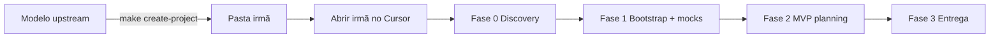

# Spawn — pasta irmã do produto

Um **produto novo** nasce como pasta **irmã** do repositório **Modelo** upstream, no **mesmo diretório pai**. Métricas, hub, mocks, REQs e conversas no Cursor ficam **isolados por pasta**.

> **Modelo/** = template e método (evolução do hub, demos, rules).  
> **../meu-produto/** = seu app (discovery → bootstrap → MVP → código).

---

## Configuração (`project.config.yaml` → `template`)

| Campo | Modelo upstream | Pasta irmã (produto) |
|-------|-----------------|----------------------|
| `is_upstream` | `true` | `false` (definido pelo spawn) |
| `sibling_spawn_required` | `true` | omitido ou `false` |
| `upstream_dev_mode` | `true` **somente** para quem mantém o template Modelo | **nunca** `true` |
| `spawned_from` | — | ex. `Modelo` |
| `spawned_at` | — | ISO8601 do spawn |
| `upstream_path` | — | caminho absoluto do Modelo usado na cópia |

**Produto spawnado** também recebe `project.name` com o nome informado em `make create-project`.

O bloco canônico de produto está em `templates/new-project/template-product.yaml`; `scripts/modelo_spawn.py` substitui a seção `template:` inteira no spawn (não só `is_upstream`).

### Estado atual — `upstream_dev_mode` no Modelo

Enquanto a evolução do template (CARD-Hub, scripts) não concluir, o **Modelo upstream** mantém `upstream_dev_mode: true`. Isso permite discovery/bootstrap no Modelo para quem mantém o método. O hub exibe um **banner informativo** e o `next_step` sugere spawn sem bloquear maintainers.

**Após concluir a evolução:** alterar manualmente para `upstream_dev_mode: false` no `project.config.yaml` do Modelo. Cópias irmãs já nascem com `false`.

### Quem trabalha onde

| Papel | Pasta aberta no Cursor | `upstream_dev_mode` |
|-------|------------------------|------------------------|
| Novo produto (FilaSaúde, etc.) | `../fila-saude` | — (não existe no produto) |
| Evoluir template Modelo (hub, CARD-Hub) | `Modelo` | `true` |
| ❌ Produto novo no Modelo | `Modelo` sem spawn | gate bloqueia (sem dev mode) |

---

## Fase −1 — Criar pasta irmã (antes de tudo)

```bash
cd /caminho/Modelo          # upstream
make create-project NAME="Fila Saúde" GIT_INIT=1
# opcional: DIR=filasaude para nome de pasta explícito
```

O script:

1. Valida que você está no **Modelo upstream** (`.modelo-upstream` ou `template.is_upstream: true`)
2. Cria **`../<slug>`** — nunca dentro de `Modelo/`
3. Copia o template (sem `.git`, `.github/`, `exports/`, `examples/`, `EVOLUCAO-MODELO.md`, caches)
4. Aplica bloco `template` de produto (`is_upstream: false`, `upstream_dev_mode: false`, `sibling_spawn_required: false`, `spawned_*`, `upstream_path`) e `project.name`
5. Cria `.modelo-product-workspace` e roda `init-new-project` + `reset-hub-activity` (hub virgem, `data_mode: real`)

### O que **não** vai para a irmã (exclusões do spawn)

| Excluído | Motivo |
|----------|--------|
| `.git/` | Repo próprio (`GIT_INIT=1` opcional) |
| `.github/` | CI do template upstream; bootstrap gera workflows de `templates/ci/` |
| `examples/` | Demos do Modelo (FilaSaúde, hub demo, etc.) |
| `exports/` | Artefatos de export do upstream |
| `EVOLUCAO-MODELO.md` | Roadmap de evolução do template |
| `.modelo-upstream` | Marcador só do repo Modelo |
| `docs/meta/improving-the-template.md` | Feedback upstream ao Modelo |
| `scripts/*demo*` | Demos do hub/métricas/qualidade (`examples/`) |
| `scripts/test_spawn_e2e.sh`, `test_modelo_spawn.py`, … | Testes CI do template upstream |
| `scripts/validate-template.sh`, `create-project-from-modelo.sh` | Só no repo Modelo upstream |
| `node_modules/`, caches | Dependências locais |

Lista canônica: `python3 scripts/modelo_spawn.py --list-excludes`. Cópia legada: `python3 scripts/modelo_spawn.py --prune /caminho/produto`.

### Depois do spawn

```bash
cd ../fila-saude
# Cursor: File → Open Folder → esta pasta (não o Modelo)
make hub-build && make hub-serve    # hub deste produto
```

**Abrir só a irmã no Cursor não perde o fluxo:** `.cursor/rules/`, `.cursor/skills/`, `AGENTS.md`, `docs/` e `scripts/` vêm na cópia. O que não copia é `.git` e histórico de chat do workspace Modelo (desejável).

### Multi-root no Cursor (opcional)

Para comparar template e produto: **File → Add Folder to Workspace** — adicione `Modelo` e `../meu-produto`. Trabalhe discovery/MVP/código **sempre** na pasta com `.modelo-product-workspace`. Use o Modelo só para evoluir scripts/rules do template.

---

## Vários produtos irmãos

```
Projetos/
├── Modelo/           # upstream
├── fila-saude/       # produto 1
└── outro-app/        # produto 2
```

| Produto | Hub local | Porta sugerida |
|---------|-----------|----------------|
| Primeiro spawn na máquina | `make hub-serve` | `8090` (padrão) |
| Segundo simultâneo | `make hub-serve HUB_PORT=8091` | `8091` |
| Demo do template (no Modelo) | `make hub-demo-serve` | `8091` |

Cada pasta: **git próprio**, `process-timeline.yaml` próprio, backlog/specs/cards próprios.

---

## O que fica no Modelo (não no produto)

- Evolução do método (`CARD-Hub-*`, scripts do hub)
- `examples/` (demos FilaSaúde, métricas demo)
- `.github/workflows/validate-modelo.yml` (CI do template)
- `EVOLUCAO-MODELO.md` (roadmap upstream)
- `docs/meta/improving-the-template.md` (feedback ao template)
- `scripts/*demo*` e testes CI do upstream (`test_spawn_e2e.sh`, etc.)
- `upstream_dev_mode: true` para desenvolvimento do template

## O que vai para a irmã (todo artefato de produto)

| Artefato | Caminho na irmã |
|----------|-----------------|
| Descoberta | `docs/discovery/` |
| Mocks HTML | `design-references/screens/` |
| Config preenchido | `project.config.yaml` |
| Backlog / cards / specs | `docs/backlog/`, `docs/tracking/cards/`, `docs/specs/` |
| Métricas | `docs/meta/process-timeline.yaml` |
| Código | `src/`, `apps/`, etc. (após bootstrap) |

---

## Comandos

| Comando | Onde rodar |
|---------|------------|
| `make create-project NAME="..." GIT_INIT=1` | Modelo upstream |
| `make repair-product-config NAME="..."` | Cópia manual legada (`cp -r`) — aplica config produto + marcador |
| `make init-new-project` | Upstream (`.modelo-upstream`) ou produto (`.modelo-product-workspace`); falha sem marcador |
| `make reset-hub-activity` | Pasta do produto — zera métricas |
| `make validate-spawn-context` | Qualquer pasta — checa upstream vs produto |
| `make hub-serve` | Pasta do produto |
| `make hub-serve HUB_PORT=8092` | Segundo hub em paralelo |

---

## Validação

```bash
make validate-spawn-context          # avisos
make validate-spawn-context STRICT=1 # falha se upstream com sinais de produto
```

Sinais de **produto no upstream** (erro se `is_upstream` e sem `upstream_dev_mode`):

- `discovery.status` ≠ `pending`
- `project.name` preenchido
- `bootstrap.status: complete`
- Telas HTML em `design-references/screens/` além do set template (`login.html`, `dashboard.html`, `item-form.html`, `_template-screen.html`)
- Arquivo `.modelo-product-workspace` ausente no upstream (esperado só na irmã)

Sinais de **config inválida na pasta irmã** (`STRICT=1`):

- `template.is_upstream: true` ou `upstream_dev_mode: true`
- Presença de `.modelo-upstream`

**CI:** `scripts/test_spawn_e2e.sh` (dry-run + spawn real + `validate-spawn-context` + `hub-build` na irmã).

---

## Fluxo completo (resumo)



Ver também: [00-project-lifecycle.md](../00-project-lifecycle.md), [00-getting-started.md](../00-getting-started.md).
